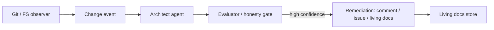

# living-docs-architect

An observer + architect + remediation loop that treats architectural documentation as agent-managed state.

**Status:** Scaffolding – Phase 0 (family paused 2026-08-19)

Built on Meridian’s gate + independent Evaluator contracts. High-confidence findings only become PR comments, issues, or living-doc edits.

## Relation to Meridian

Rules and change events feed an architect agent. The Evaluator / honesty gate decides whether a finding is real enough to act on. Optional later packaging as a dsh plugin.

## Shared contracts

- [GATE_CONTRACT.md](https://github.com/PCSchmidt/portfolio-kit/blob/main/docs/GATE_CONTRACT.md)
- [EVAL_RUBRIC_TEMPLATE.md](https://github.com/PCSchmidt/portfolio-kit/blob/main/docs/EVAL_RUBRIC_TEMPLATE.md)
- [MEMORY_SCHEMA.md](https://github.com/PCSchmidt/portfolio-kit/blob/main/docs/MEMORY_SCHEMA.md)
- [DATA_POLICY.md](https://github.com/PCSchmidt/portfolio-kit/blob/main/docs/DATA_POLICY.md)

## Architecture

## Planned phases

1. Small rule set (layering, forbidden imports, required tests) on one public repo
2. Observer (local git or GitHub webhook)
3. Architect agent → structured findings
4. Remediation (comments / issues / ARCHITECTURE.md updates)
5. Gate so only high-confidence findings act
6. Dogfood on Meridian / HardPowerIntelligence / this family

## Public / unclassified data only

Dogfood targets are your own public repos. No employer or program-of-record trees.

## Current tree

Phase 0 is documentation only.
