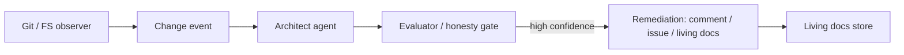

# living-docs-architect

An observer + architect + remediation loop that treats architectural documentation as agent-managed state.

**Status:** Phase 4 — gated local remediation

Built on Meridian’s gate + independent Evaluator contracts. High-confidence findings only get `act: true`. Phase 4 applies gated proposals to local `ARCHITECTURE.md` and `.living-docs/comments.jsonl`. It never posts GitHub comments, issues, or webhooks.

## Relation to Meridian

Rules and change events feed an architect agent. The Evaluator / honesty gate decides whether a finding is real enough to act on. Optional later packaging as a dsh plugin.

## Shared contracts

- [GATE_CONTRACT.md](https://github.com/PCSchmidt/portfolio-kit/blob/main/docs/GATE_CONTRACT.md)
- [EVAL_RUBRIC_TEMPLATE.md](https://github.com/PCSchmidt/portfolio-kit/blob/main/docs/EVAL_RUBRIC_TEMPLATE.md)
- [MEMORY_SCHEMA.md](https://github.com/PCSchmidt/portfolio-kit/blob/main/docs/MEMORY_SCHEMA.md)
- [DATA_POLICY.md](https://github.com/PCSchmidt/portfolio-kit/blob/main/docs/DATA_POLICY.md)

## Architecture



## Develop

```sh
npm test
npm run eval
npm run scan
npm run observe
npm run architect
npm run remediate
npm run remediate:apply
```

Requires Node.js 20+. No dependencies, no network. `npm run remediate` is dry-run. `npm run remediate:apply` writes local living-doc files. `--github-write`, `--comment`, and `--issue` are refused.

## Planned phases
1. Small rule set (layering, forbidden im(mechanical, no LLM)
4. Remediation (local ARCHITECTURE.md / comment log) *(this increment)*
3. Architect agent → structured findings *(this increment; mechanical, no LLM)*
4. Remediation (comments / issues / ARCHITECTURE.md updates)
5. Gate so only high-confidence findings act
6. Dogfood on Meridian / this family — not HardPowerIntelligence until asked

## Public / unclassified data only

Fixture target is [fixtures/sample-app](fixtures/sample-app). No employer or program-of-record trees.

## Current tree

```
CONTRACT.md
SPEC.md
rules/rules.json
fixtures/sample-app/
src/scan.js
src/gate.js
src/observe.js
src/architect.js
src/remediate.js
eval/cases.json
tests/
```
