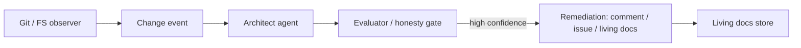

# living-docs-architect

An observer + architect + remediation loop that treats architectural documentation as agent-managed state.

**Status:** Phase 2 — local git observer

Built on Meridian’s gate + independent Evaluator contracts. High-confidence findings only get `act: true`. Phase 2 watches a local git worktree and never writes GitHub comments or issues.

## Relation to Meridian

Rules and change events feed an architect agent. The Evaluator / honesty gate decides whether a finding is real enough to act on. Optional later packaging as a dsh plugin.

## Shared contracts

- [GATE_CONTRACT.md](https://github.com/PCSchmidt/portfolio-kit/blob/main/docs/GATE_CONTRACT.md)
- [EVAL_RUBRIC_TEMPLATE.md](https://github.com/PCSchmidt/portfolio-kit/blob/main/docs/EVAL_RUBRIC_TEMPLATE.md)
- [MEMORY_SCHEMA.md](https://github.com/PCSchmidt/portfolio-kit/blob/main/docs/MEMORY_SCHEMA.md)
- [DATA_POLICY.md](https://github.com/PCSchmidt/portfolio-kit/blob/main/docs/DATA_POLICY.md)

## Architecture



## Develop

```sh
npm test
npm run eval
npm run scan
npm run observe
```

Requires Node.js 20+. No dependencies, no network. `npm run observe` snapshots `git status` in the current tree. It refuses `--github-write`, `--comment`, and `--issue`.

## Planned phases

2. Observer (local git) *(this increment; GitHub webhook later)*
3. Architect agent → structured findings *(mechanical scan shipped; LLM later)*
4. Remediation (comments / issues / ARCHITECTURE.md updates)
5. Gate so only high-confidence findings act
5. Gate so only high-confidence findings act *(this increment)*
6. Dogfood on Meridian / this family — not HardPowerIntelligence until asked

## Public / unclassified data only

Fixture target is [fixtures/sample-app](fixtures/sample-app). No employer or program-of-record trees.

## Current tree

```
CONTRACT.md
SPEC.md
rules/rules.json
fixtures/sample-app/
src/scan.js
src/gate.js
src/observe.js
eval/cases.json
tests/
```
